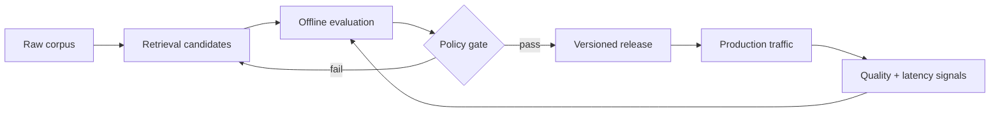

<div align="center">
  
</div>

<div align="center">
  <a href="https://amulyagupta.in"><b>ENTER PORTFOLIO</b></a>
  &nbsp;·&nbsp;
  <a href="https://www.linkedin.com/in/amulya-gupta-bits-pilani/"><b>LINKEDIN</b></a>
  &nbsp;·&nbsp;
  <a href="mailto:amulyagupta2001@gmail.com"><b>OPEN A CHANNEL</b></a>
</div>

<br />

```text
signal.in ──► retrieve ──► reason ──► evaluate ──► ship ──► observe
                 ▲                                      │
                 └────────────── learn ─────────────────┘
```

I’m **Amulya Gupta**, an AI & MLOps engineer working where promising models meet unforgiving production systems. I build retrieval systems, ML platforms, and Python services designed to remain useful after the demo.

> Current question: **How should a retrieval system adapt when every corpus behaves differently?**

## `01 / SYSTEMS_ONLINE`

| System | Mission | Engineering signal |
| :-- | :-- | :-- |
| **[RetrievalOps](https://github.com/amulyagupta1278/retrievalops)** | Select and safely release corpus-adaptive retrieval policies | Evaluation · observability · safe rollout |
| **[RAG Retrieval Dissertation](https://github.com/amulyagupta1278/rag-retrieval-dissertation)** | Investigate retrieval quality beyond one-size-fits-all RAG | Research · benchmarking · Python |
| **[Agentic Ticket Automation](https://github.com/amulyagupta1278/agentic-ai-ticket-automation)** | Explore agent-driven support workflows | Agents · orchestration · applied AI |
| **[MLOps Assignment](https://github.com/amulyagupta1278/MLOPS_Assignment)** | Run heart-disease prediction through the ML lifecycle | MLflow · FastAPI · Docker · monitoring |

<details>
<summary><b>Inspect the architecture</b></summary>
<br />


</details>

## `02 / OPERATING_PRINCIPLES`

```yaml
build:
  for: measurable user outcomes
  with: Python, retrieval, ML platforms, production APIs
  under: tests, observability, reproducible evaluation

avoid:
  - demos without failure modes
  - metrics without decisions
  - AI complexity without operational value
```

## `03 / FIELD_NOTES`

- Shipped **40+ production campaigns** reaching **20M+ users** through Adobe Journey Optimizer infrastructure.
- Work across the full path from experimentation and data pipelines to inference APIs, containers, and monitoring.
- Studying **M.Tech in AI & ML at BITS Pilani (WILP)** after an **M.Sc. with a Data Science minor**.
- Exploring retrieval evaluation, agent systems, LLM adaptation, and dependable AI operations.

## `04 / TOOLING`

`Python` · `PyTorch` · `TensorFlow` · `scikit-learn` · `FastAPI` · `MLflow` · `Prefect` · `PostgreSQL` · `Docker` · `Kubernetes` · `AWS` · `GCP` · `Prometheus` · `Grafana`

---

<div align="center">
  <sub><code>AMULYA.OS</code> is open to collaborations in retrieval, AI infrastructure, MLOps, and production Python.</sub>
  <br /><br />
  <b>Build the intelligence. Engineer the trust.</b>
</div>
