  

  <a href="https://amulyagupta.in"><b>ENTER PORTFOLIO</b></a>
  &nbsp;·&nbsp;
  <a href="https://www.linkedin.com/in/amulya-gupta-bits-pilani/"><b>LINKEDIN</b></a>
  &nbsp;·&nbsp;
  <a href="mailto:amulyagupta2001@gmail.com"><b>OPEN A CHANNEL</b></a>

 

I’m **Amulya Gupta**, an AI & MLOps engineer working where promising models meet unforgiving production systems. I build retrieval systems, ML platforms, and Python services designed to remain useful after the demo.

> **Current transmission:** How should a retrieval system adapt when every corpus behaves differently?

  

  <b>OPEN SYSTEM:</b>
  <a href="https://github.com/amulyagupta1278/retrievalops">RETRIEVALOPS</a>
  &nbsp;·&nbsp;
  <a href="https://github.com/amulyagupta1278/rag-retrieval-dissertation">RAG LAB</a>
  &nbsp;·&nbsp;
  <a href="https://github.com/amulyagupta1278/agentic-ai-ticket-automation">AGENT DESK</a>

<b>ACCESSIBLE TEXT MODE / inspect the evidence</b>

 

- **RetrievalOps:** corpus-adaptive retrieval policy evaluation, observability, and safe release.
- **RAG Retrieval Dissertation:** retrieval research, benchmarking, and Python experimentation.
- **Agentic Ticket Automation:** agent orchestration applied to support workflows.
- Shipped **40+ production campaigns** reaching **20M+ users** through Adobe Journey Optimizer infrastructure.
- Studying **M.Tech in AI & ML at BITS Pilani (WILP)** after an **M.Sc. with a Data Science minor**.
- **Tooling:** Python, PyTorch, TensorFlow, scikit-learn, FastAPI, MLflow, Prefect, PostgreSQL, Docker, Kubernetes, AWS, GCP, Prometheus, and Grafana.

---

  <code>AMULYA.OS</code> is open to collaborations in retrieval, AI infrastructure, MLOps, and production Python.
    
  <b>Build the intelligence. Engineer the trust.</b>

