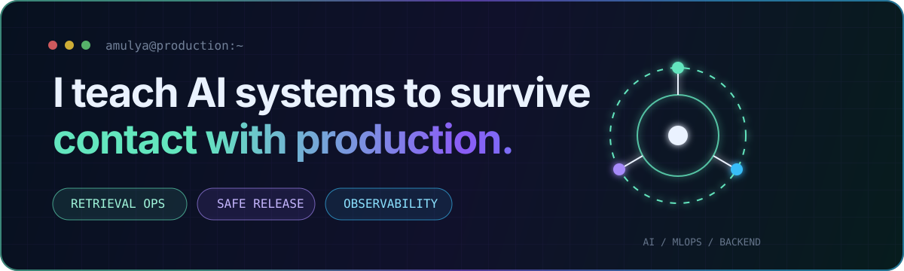
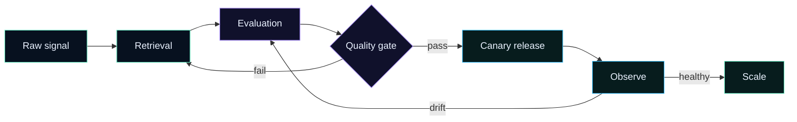

<p align="center">
  
</p>

<p align="center">
  <a href="https://amulyagupta.in"><b>Portfolio</b></a> ·
  <a href="https://www.linkedin.com/in/amulya-gupta-bits-pilani/"><b>LinkedIn</b></a> ·
  <a href="mailto:amulyagupta2001@gmail.com"><b>Build with me</b></a>
</p>

```python
amulya = {
    "role": "AI & MLOps Engineer",
    "obsession": "making intelligent systems measurable, releasable, and reliable",
    "building": ["retrieval systems", "evaluation pipelines", "production AI platforms"],
    "rule": "if it cannot be observed, it is not ready for production",
}
```

## Mission control

These are not notebook demos. Each project answers a production question.

| System | Mission | Production signal |
|---|---|---|
| **[RetrievalOps](https://github.com/amulyagupta1278/retrievalops)** | Choose the best retrieval policy for each corpus | Frozen quality gates, drift detection, canaries, observability, rollback |
| **[RAG Retrieval Lab](https://github.com/amulyagupta1278/rag-retrieval-dissertation)** | Find what actually improves retrieval | Five-system benchmark, human judgments, reproducible evidence |
| **[AI Operations Command Center](https://github.com/amulyagupta1278/incident-response-system)** | Turn incidents into evidence-backed recovery plans | Secure ingestion, multi-agent RCA, audit trails, offline fallbacks |
| **[Agentic Ticket Automation](https://github.com/amulyagupta1278/agentic-ai-ticket-automation)** | Resolve support issues before they escalate | Classification, RAG, agent routing, MLflow, Prometheus, Grafana |

## My production loop



## Toolbox, not trophy case

`Python` · `FastAPI` · `PostgreSQL` · `MLflow` · `Docker` · `Kubernetes` · `GitHub Actions` · `Prometheus` · `Grafana` · `AWS` · `GCP`

I use tools when they strengthen an evidence trail: versioned inputs, reproducible evaluations, explicit release gates, observable behavior, and safe failure modes.

## Current coordinates

- 🎓 M.Tech in Artificial Intelligence & Machine Learning at **BITS Pilani**
- 🧪 Exploring retrieval policy selection, RAG evaluation, and dependable agent systems
- 🤝 Open to AI infrastructure, MLOps, retrieval, and backend collaborations

<p align="center">
  <i>Build the model. Test the system. Observe reality.</i>
</p>
